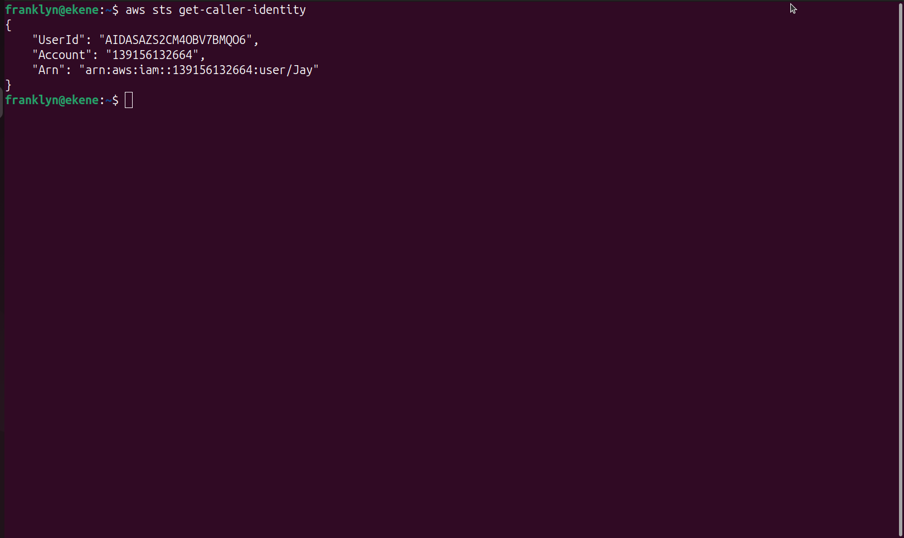
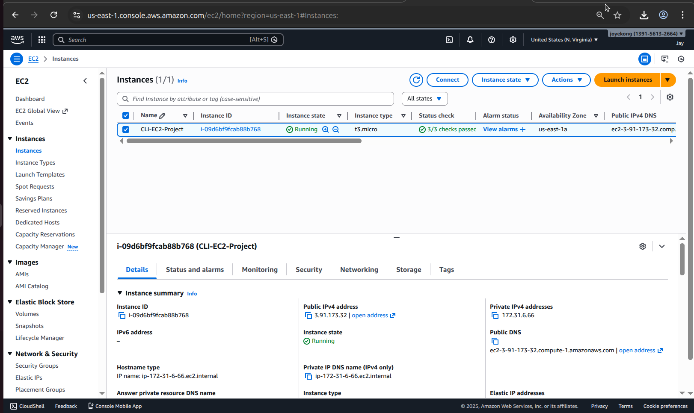
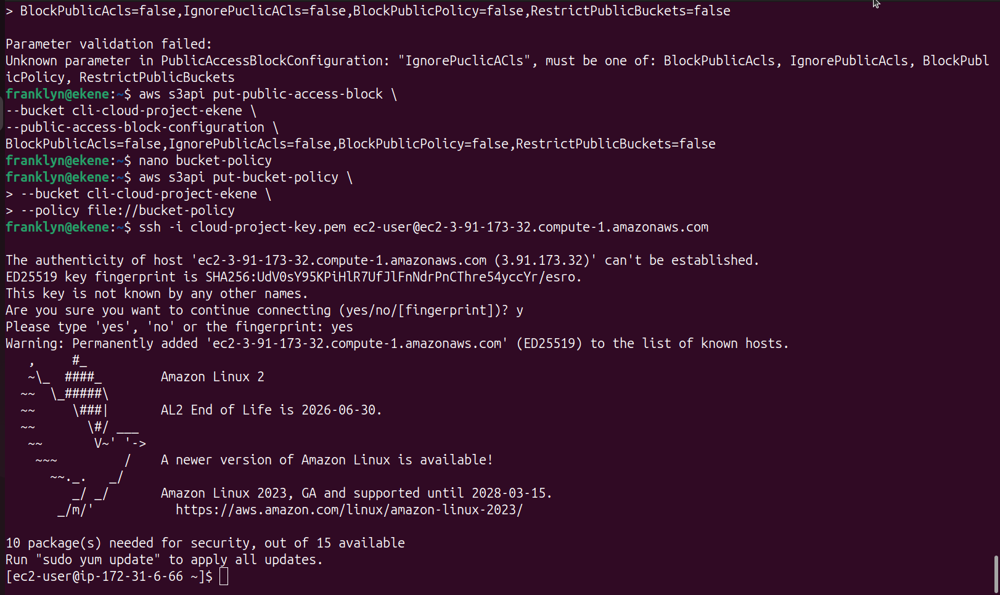
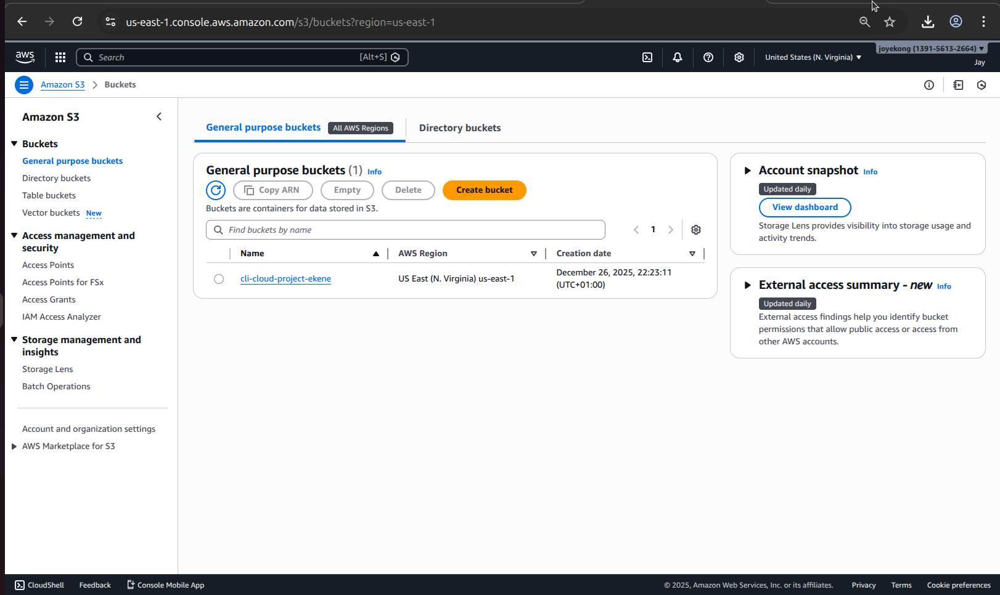
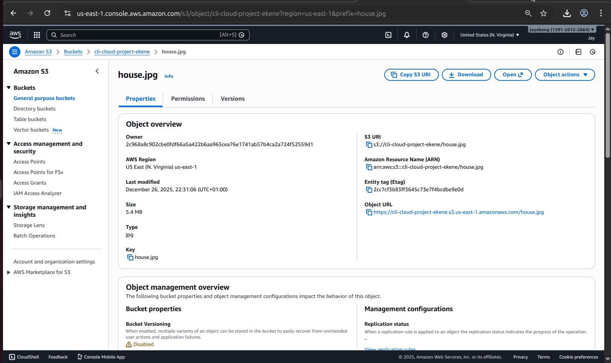
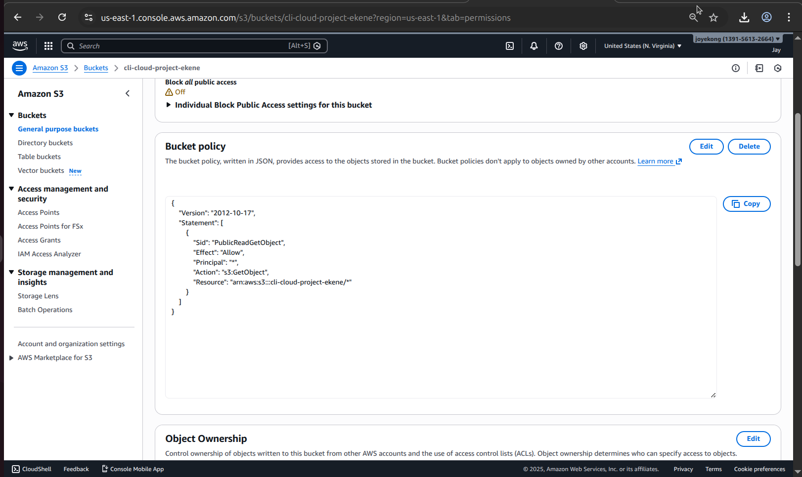
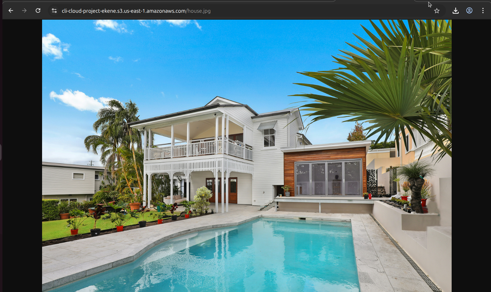

# AWS CLI Cloud Project

on this project, I was to provision AWS Infrastructure using AWW command line interface (CLI) on my local terminal.

# Services Used
Some of the services that were used in executing this project are listed below:

- Amazon EC2
- AWS IAM
- Amazon S3
- AWS CLI
- Git and GitHub

# The Major Activities of the Project:
- Configured AWS access key on the CLI

- Created an Amazon EC2 through the CLI

-Connected to the EC2 server via CLI ssh

- created an s3 bucket through the CLI

- Uploaded an image to the s3 bucket

- Configured a Public Read-Access Only to the Uploaded Image

- Verified the image

- Documented the results with screenshots
- Documented the project using Git and nano text editor
- Updated the project on Github from the CLI

# Screenshots
The screenshots for the projects outcomes are attached in the folder
 
